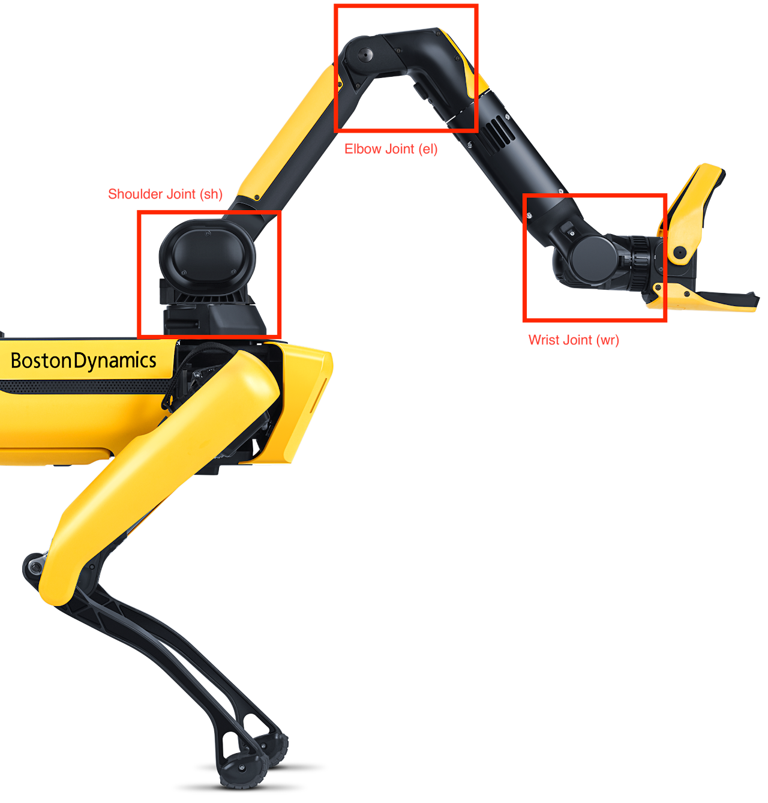

## Basic Concepts

Before we dive in to any real code, let's go over some basic methods that you should be familiar with.

We still use the basic idea of first generating a RobotCommand and then executing the command with ```command_client.robot_command```.

This section will be focused on controlling Spot's arm and claw attachment with code.

## Stow/Unstow

Let's learn how to stow and unstow the arm. The code is simple:

```py
unstow = RobotCommandBuilder.arm_ready_command()
unstow_command_id = command_client.robot_command(unstow)
block_until_arm_arrives(command_client, unstow_command_id, 3.0)
```

We create a RobotCommand with the ```arm_ready_command()``` called **unstow**.

Notice that we also create a variable called ```unstow_command_id``` when running robot_command(). Not only does this execute the RobotCommand, it also assigns ```unstow_command_id``` to the the ID value of the robot_command. We can use the ID value to track the progress of the robot_command in question.

This is shown in the third line where we use a ```block_until_arm_arrives``` function to **block (or stop)** all other functions **until** the ```unstow``` RobotCommand is FULLY complete. This prevents any other actions from interfering with the movement of the arm. It is important to consider blocking when you have more complex code that requires the management of multiple parts of Spot.

The "3.0" in the ```block_until_arm_arrives``` refers the maximum amount of time that the code will block for. This means that if more than 3 seconds has passed AND the arm has NOT finished its movement, the code will move on from the unstow movement anyways. This prevents a deadlock situation where Spot is stuck on one movement forever.

## Arm  Manipulation - Controlling the Joints

The first method of controlling the arm is to control the individual values of the 6 joints on the arm. Because each joint can be thought of as a circular range where the motor can spin to, we can control each joint with ```radians```. 

<figure markdown="span">
    { width="400"; loading=lazy }
    <figcaption>A diagram of the joints on Spot. Note that even though there are only 3 locations shown, there are actually **6** different joints. At each location (marked with a red box), there are actually TWO joints - One joint for rotating CW/CCW and another for rotating up/down.</figcaption>
</figure>

```py
def make_robot_command(arm_joint_traj)
    # convert joint points to an actual movement command to send to Spot
    joint_move_command = arm_command_pb2.ArmJointMoveCommand.Request(trajectory=arm_joint_traj)
    
    # create an ArmCommand object with our movement command
    arm_command = arm_command_pb2.ArmCommand.Request(arm_joint_move_command=joint_move_command)
    
    # make sure our arm movement is synchronized (like all of our other movements) 
    sync_arm = synchronized_command_pb2.SynchronizedCommand.Request(arm_command=arm_command)
    
    # convert to a general RobotCommand
    arm_sync_robot_cmd = robot_command_pb2.RobotCommand(synchronized_command=sync_arm)
    
    # build the final command
    return RobotCommandBuilder.build_synchro_command(arm_sync_robot_cmd)

while True:
    # get inputs
    sh0 = float(input("sh☺ >> ")) sh1 = float(input("sh1 >> "))
    elo = float(input("elo >> "))
    el1 = float(input("el1 >> "))
    wro = float(input("wr☺ >> "))
    wr1 = float(input("wr1 >> "))
    mv = float(input("max velocity >> "))
    ma = float(input("max acceleration >> "))
    
    # convert mv/ma inputs into a specific DoubleValue type that Spot can understand 
    max_vel = wrappers_pb2. DoubleValue(value=mv)
    max_acc = wrappers_pb2.DoubleValue(value=ma)
    
    # convert to a specific movement trajectory and a specific point in 3D space 
    traj_point = RobotCommandBuilder.create_arm_joint_trajectory_point(sho, sh1, elo, el1, wro, wr1)
    
    # set up the trajectory, set maximum velocity and acceleration 
    arm_joint_traj = arm_command_pb2.ArmJointTrajectory(points=[traj_point], maximum velocity=max_vel, maximum_acceleration=max_acc)
    
    command = make_robot_command(arm_joint_traj) # build the ArmCommand 
    cmd_id = command_client.robot_command(command) # execute ArmCommand 
    time.sleep(0.5)
```

The code above is a mouthful, so let's go over it in detail.

We need to write a helper function first called ```make_robot_command```, which will centralize all of the necessary commands needed to set up a joint movement. We will use the ```make_robot_command``` function every time we want to make a new movement. The ```make_robot_command``` function will convert a simple set of points into a single movement through 3D space.

We can then  run our inputs in an infinite loop so that Spot will constantly be updating  its position to the newest input.

We can then get inputs for each joint movement. The guide below will explain what each input variable means:

"sh-" = movement of shoulder joint

"el-" = movement of elbow joint

"wr-" = movement of wrist joint

sh0 = shoulder left/right

sh1 = shoulder up/down

el0 = elbow up/downn

el1 = elbow rotation clockwise (CW) or counterclockwise (CCW)

wr0 = wrist up/down

wr1 = wrist CW/CCW

Remember, the input values are  in radians. Feel free to add in code to convert between radians and degrees if you feel more comfortable inputting degrees instead.

## Claw - Opening and closing

Basic code for opening and closing the claw. We've seen the RobotCommand +  command_client.robot_command usage many times before in movement, so this should be pretty  understandable. We create RobotCommands for both  the opening and closing of the claw and execute the RobotCommand just to open the claw. If you want to close the claw, change the ```robot_command(open_claw)``` to ```robot_command(close_claw)```.

```py
open_claw = RobotCommandBuilder.claw_gripper_open_command()
close_claw = RobotCommandBuilder.claw_gripper_close_command()
open_id = command_client.robot_command(open_claw)
```

## Claw - Types of grasping

There are different ways Spot can pick up an object:

1. Top-down: Spot will try to grab with the claw perpendicular to the ground (grab the object by the top)

2. Horizontal: Spot will try to grab with the claw parallel to the ground (grab the object by the side)

3. 45-Angle: Spot will try to approach the object at a 45 degree angle

4. Force Squeeze: Spot will disregard any approach angle and just close the  claw at the exact point that the user set.

## Picking objects up

In this section, you will learn how to pick and object up with built-in commands and functions from the Spot SDK. Go your ```./spot-sdk/python/examples/arm_grasp``` folder. Take a look at the ```arm_grasp.py``` file. This file will do a few things

1. Get a stationary image from Spot's front left camera

2. Open a GUI window to allow you to manually click on the object you want Spot to pick up

3. Spot will automatically detect the object and pick it up.

This code is relatively complex, so we will just look at the arm movement for  now (and ignore the camera/image processing).

```py
# find the object that the user selected so that Spot will know where to grasp 
grasp = manipulation_api_pb2.PickObjectInImage(
    pixel_xy=pick_vec, 
    transforms_snapshot_for_camera=image.shot.transforms_snapshot,
    frame_name_image_sensor=image.shot.frame_name_image_sensor,
    camera_model=image.source.pinhole)

# set a type of grasping (see above)
add_grasp_constraint(config, grasp, robot_state_client)

# use the ManipulationApiRequest to request Spot to run the pickup command 
grasp_request = manipulation_api_pb2.ManipulationApiRequest(pick_object_in_image=grasp)

# send the request
cmd_response = manipulation_api_client.manipulation_api_command(
    manipulation_api_request=grasp_request)

# get feedback from Spot (whether or not the grasp succeeded)
while True: # have this in a loop so that Spot will continuously try to grasp the object 
    feedback_request = manipulation_api_pb2. ManipulationApiFeedbackRequest( manipulation_cmd_id=cmd_response.manipulation_cmd_id)
    
    # send the request
    response = manipulation_api_client.manipulation_api_feedback_command(
        manipulation_api_feedback_request=feedback_request)
    print(
        f'Current state: {manipulation_api_pb2. ManipulationFeedbackState.Name (response.current_state)}')

    if response.current_state == manipulation_api_pb2.MANIP_STATE_GRASP_SUCCEEDED or response.current_state == manipulation_api_pb2.MANIP_STATE_GRASP_FAILED:
        break
    
    time.sleep(0.25)
```

## Project - Throwing an object

Because the pickup sequence is already pre-written, just edit the arm_grasp.py file. You should edit right below the line that says robot.logger.info('Finished grasp.')

Our throwing sequence should look like this:

1. Begin moving the arm from the ground --> to the sky (underhand toss)

2. As the arm is moving up, open the claw while continuing the arm movement (this requires a tool called "async",  we will learn about that)

## What is async?

Asynchronous (async) programming allows you to write concurrent code that can efficiently handle multiple tasks without blocking the execution of the program. This is particularly useful for tasks that involve multitasking (doing two actions at the same time). We need to asynchronously open the claw WHILE the arm is still moving upwards to carry the momentum of the arm into the throw.

Now, let's take a look at the code:

```py
robot.logger.info('Finished grasp.')
# throwing code starts below:

# set up joint movements
sh0 = 0
sh1 = -0.6
elo = -0.5
el1 = 0
wr0= -0.3
wr1 = 0
max_vel = wrappers_pb2.DoubleValue(value=8)
max_acc = wrappers_pb2. DoubleValue(value=10)

traj_point = RobotCommandBuilder.create_arm_joint_trajectory_point(sh0, sh1, elo, el1, wro, wr1)

arm_joint_traj = arm_command_pb2.ArmJointTrajectory(
    points=[traj_point],
    maximum_velocity=max_vel, 
    maximum_acceleration=max_acc
)

# Make a RobotCommand
command = make_robot_command(arm_joint_traj)
open = RobotCommandBuilder.claw_gripper_open_command()
# Send the request
cmd_id = command_client.robot_command_async(command)

# set the start time at which the arm starts moving upwards 
start_time = time.time()
end_time = start_time + 2.0 # set arbitrary end time
x = 0 # create tick counter

while time.time() < end_time: # while the current time is less than the end time
    if x == 3: # if the current tick hits 3 (which is 0.15 seconds after arm starts moving up) 
        o_i = command_client.robot_command_async(open) # open claw asynchronously
    time.sleep(0.05) # every "tick" is 0.05 seconds
    x += 1 # increase tick counter

time.sleep(1)
```

We define a "tick" as 0.05 seconds. Each tick, we check if we have reached the correct time to release the claw. We should release the claw at 0.15 seconds after the arm first begins moving up.

We  can use the ```robot_command_async``` instead of ```robot_command``` to set up an asynchronous command (one that can run in parallel with another command).

## Exercise: Follow fiducial AND throw object

Try to combine the fiducial_follow and arm_grasp/throw functions into one. Your code should do the following:

1. Spot picks up object

2. Spot sees human in the room holding a fiducial

3. Spot turns and moves towards human while carrying object

4. Spot stops in front of human and tosses object at human

<iframe width="560" height="315" src="https://www.youtube.com/embed/e2GBr1BjJxQ?si=r_pRplkBjLp9homz" title="YouTube video player" frameborder="0" allow="accelerometer; autoplay; clipboard-write; encrypted-media; gyroscope; picture-in-picture; web-share" referrerpolicy="strict-origin-when-cross-origin" allowfullscreen></iframe>