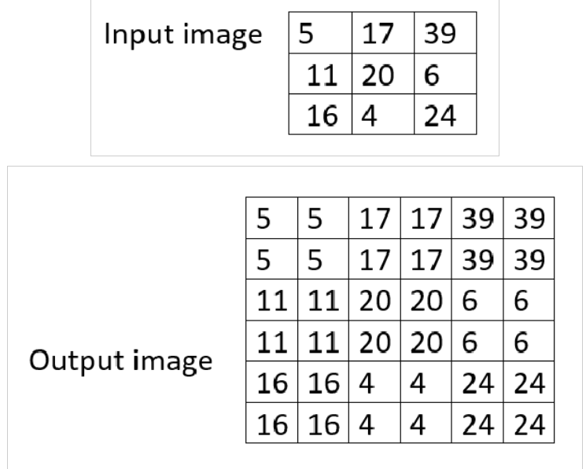

???+ abstract "Objective"
    Utilize the Apriltag library to generate Apriltag images of any size, and then associate the tag with a Spot Mission.

AprilTags are a type of visual fiducial system that are used in a wide range of applications, including augmented reality, robotics, and camera calibration. They are essentially visual markers that can be printed on paper and detected by a camera, allowing for precise 3D positioning and identification of objects. They look like QR codes, with each pixel being colored white or black. AprilTags were developed by researchers at the University of Michigan in 2011 and have since been refined to increase their robustness and speed of detection. The AprilTag library is implemented in C with no external dependencies, making it easily portable to embedded devices. There are also implementations available in Java and C++. AprilTags are a popular choice for computer vision applications due to their accuracy and low performance overhead.

Apriltags are important for Spot because they allow for precise 3D positioning and identification of objects. Spot recognizes Apriltag fiducials that meet the correct size requirements. Apriltags are used to help the robot know where it is on the field, so it can align itself to some goal position. Apriltags provide a means of identification and 3D positioning, even in low visibility conditions. The tags act like barcodes, storing a small amount of information (tag ID), while also enabling simple and accurate 6D (x, y, z, roll, pitch, yaw) pose estimation of the tag.

Spot has a basic prerequisites for AprilTags:

- Must be in the Tag36h11 set
- AprilTags are separated into "sets," which are collections of AprilTags with similar sizes and properties

## Upscaling the fiducials

Why upscale? The images that have been downloaded are just 10 pixels by 10 pixels, which looks very blurry and small. We can use code to upscale (or increase the size of) the fiducials so that they can be clearly printed

1. Download an example Apriltag [here](https://github.com/AprilRobotics/apriltag-imgs/blob/master/tag36h11/tag36_11_00000.png) (the download button is in the top right).
2. Copy this Python code into your IDE (save the file as ```upscale.py```)
    ```py
    from PIL import Image

    # Load the original PNG image
    original_image = Image.open('./tag36_11_00000.png')

    # Define the desired upscale factor
    upscale_factor = 100 # Replace with the desired value

    # Calculate the new width and height
    new_width = original_image.width * upscale_factor
    new_height = original_image.height * upscale_factor

    # Perform the upscale using the 'NEAREST' resampling method for a lossless result
    upscaled_image = original_image.resize((new_width, new_height), resample=Image.NEAREST)

    # Save the upscaled image as a new PNG file
    upscaled_image.save('upscaled_image.png')
    ```

???+ note
    Make sure your download AprilTag is in the same folder as your Python code.

- **Line 1**: This is an **import command**. "PIL" is a **Python package**. It is a set of prewritten code that someone else has written. The PIL package contains prewritten code for image processing, so we won't have to write the complex functions again. More specifically, we import the **Image** class from the PIL package. This gives us access to all the functions related to the Image class.

- **Line 4**: We use the .open() function from the Image class in order to load the original image into a variable. The text inside the quotation marks is called a **filepath**. The "./" tells the computer that the file is located in the same folder that the code is in.

- **Line 7**: This is constant that the computer will use to upscale the image by. We have it set to 100 but feel free to play around with the value.

- **Line 10 + 11**: After loading the file into the variable in Line 4, we can get the ```.width``` and ```.height``` attributes from the image. As you would expect, we are given the original image's width and height. We then multiply the original dimensions by the upscaling factor. For example, the original image is 10 pixels by 10 pixels. However, the upscaled image will be 1000 pixels by 1000 pixels

- **Line 14**: We resize the original image with the "nearest neighbor" resizing algorithm shown below:

    <figure markdown="span">
        { width="300"; loading=lazy }
    </figure>

- This algorithm is very simple and efficient. It will just fill the nearest neighboring pixels with the same color as the originally chosen pixel. Because AprilTags are very simple images, such a simple algorithm is sufficient.

- **Line 17**: Finally, we save the upscaled image as "upscaled_image.png"

Open the downloaded tag. You should see that the tag is very small (it should be just a few pixels wide/tall).

Run the python code. Open the file called "upscaled_image.png". You should see that your new image is much larger and is easier to recognize.

Congratulations! You have just upscaled and formatted your own Apriltag!

## Testing

To test that your new Apriltag works, print out ```upscaled_image.png.```

Go into your spot-sdk directory and go to ```python/examples/fiducial_follow.``` Follow the instructions to get the example running on Spot.

Once the code is running, stand in front of Spot with your printed and upscaled Apriltag. Spot will follow your position and orient itself in front of you.

## Using the fiducial

In the same python examples folder where ```hello_spot.py``` is, there is another example file called       ```fiducial_follow.py``` in the ```fiducial_follow``` folder. ```fiducial_follow.py``` can teach us a lot about autonomous Spot movement and using code to help Spot recognize fiducials.

<figure markdown="span">
    <video controls="true" allowfullscreen="true">
        <source src="../../media/vision-demo.mp4" type="video/mp4">
    </video>
</figure>