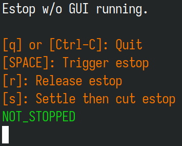
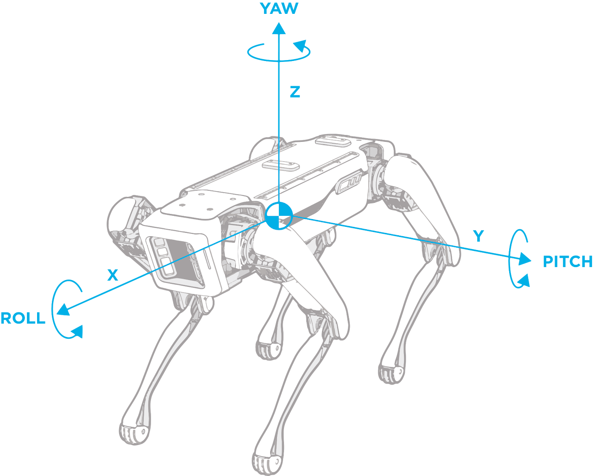

???+ abstract "Objective"
    You will be able to use code to power on and move Spot.

# Introduction to Radians
Radians are used an alternative to degrees to measure distance around a circle. Instead of being from a range of 0-360, radians describe the angle using a fraction of 2pi.

Please learn about radians with the links below:

- [Simple Wikipedia](https://simple.wikipedia.org/wiki/Radian)
- [MathIsFun](https://www.mathsisfun.com/geometry/radians.html)


# Setting up the Estop
Before running any actions on Spot, you need to turn on the estop so that you can cut power to the motors manually if something goes wrong. To run the estop, you can use the pre-written estop client in the SDK. Go to `./spot-sdk/python/examples/estop` in the `spot-sdk` folder that you cloned from GitHub. You can choose to run either the gui or the nogui version - the functionality is the same. If the gui version doesn't work (because you are missing graphical dependencies), you can run the nogui version.

<figure markdown="span">
  { width="400"; loading=lazy }
  <figcaption>Image of the nogui (terminal-based) estop UI</figcaption>
</figure>


# Powering Up and Connecting to Spot
Create a new Python file called `hello_spot.py`.


First, we need to import a few necessary libraries:
```py
from __future__ import print_function

import argparse
import os
import sys
import time
import math
import random

import bosdyn.client
import bosdyn.client.lease
import bosdyn.client.util
import bosdyn.geometry
from bosdyn.client.image import ImageClient
from bosdyn.api import arm_command_pb2, geometry_pb2
from bosdyn.client import math_helpers
from bosdyn.client.frame_helpers import GRAV_ALIGNED_BODY_FRAME_NAME, ODOM_FRAME_NAME, get_a_tform_b
from bosdyn.client.robot_command import (RobotCommandBuilder, RobotCommandClient,
                                         block_until_arm_arrives, blocking_stand)
from bosdyn.client.robot_state import RobotStateClient
```
We import some generic python libraries, as well as a host of functions from the bosdyn.client, which give us the ability to access the robot and control its subsystems (movement, arm, claw).

Next, we will write some setup code to allow us to connect to Spot:
```py
def main(argv):
    """Command line interface."""
    parser = argparse.ArgumentParser()
    bosdyn.client.util.add_base_arguments(parser)
    options = parser.parse_args(argv)
    try:
        hello_spot(options) # We will write the hello_spot() function later to actually give Spot functionality
        return True
    except Exception as exc:
        logger = bosdyn.client.util.get_logger()
        logger.error("Hello, Spot! threw an exception: %r", exc)
        return False


if __name__ == '__main__':
    if not main(sys.argv[1:]):
        sys.exit(1)
```
The above code serves the purpose of nesting the `hello_spot()` function in a try-catch loop, to make sure that our program catches any unforeseen errors and handles them accordingly. 

Now, let's get right into the heart of our program. Right below the imports, define a new function called `hello_spot().` At the start of this function, we will setup logging (to keep a constant stream of telemetry), create an instance of the SDK (which will be our client to access commands, and create an instance of the robot (which we will pass commands to). We will also authenticate our client so that Spot recognizes our commands and follows them.

```py
def hello_spot(config):
    """A simple example of using the Boston Dynamics API to command a Spot robot."""

    # The Boston Dynamics Python library uses Python's logging module to
    # generate output. Applications using the library can specify how
    # the logging information should be output.
    bosdyn.client.util.setup_logging(config.verbose)

    # The SDK object is the primary entry point to the Boston Dynamics API.
    # create_standard_sdk will initialize an SDK object with typical default
    # parameters. The argument passed in is a string identifying the client.
    sdk = bosdyn.client.create_standard_sdk('HelloSpotClient')

    # A Robot object represents a single robot. Clients using the Boston
    # Dynamics API can manage multiple robots, but this tutorial limits
    # access to just one. The network address of the robot needs to be
    # specified to reach it. This can be done with a DNS name
    # (e.g. spot.intranet.example.com) or an IP literal (e.g. 10.0.63.1)
    robot = sdk.create_robot(config.hostname)

    # Clients need to authenticate to a robot before being able to use it.
    bosdyn.client.util.authenticate(robot)

    # Establish time sync with the robot. This kicks off a background thread to establish time sync.
    # Time sync is required to issue commands to the robot. After starting time sync thread, block
    # until sync is established.
    robot.time_sync.wait_for_sync()

    # Verify the robot is not estopped and that an external application has registered and holds
    # an estop endpoint.
    assert not robot.is_estopped(), "Robot is estopped. Please use an external E-Stop client, " \
                                    "such as the estop SDK example, to configure E-Stop."
```
With all that setup out of the way, let's establish a lease and power on the robot. As mentioned in an earlier section, the lease is needed to establish our client as the current sole controller of the robot. 

```py
    # ... see previous code block

    # Establish the lease
    lease_client = robot.ensure_client(bosdyn.client.lease.LeaseClient.default_service_name)
    with bosdyn.client.lease.LeaseKeepAlive(lease_client, must_acquire=True, return_at_exit=True):
        # Now, we are ready to power on the robot. This call will block until the power
        # is on. Commands would fail if this did not happen. We can also check that the robot is
        # powered at any point.
        robot.logger.info("Powering on robot... This may take several seconds.")
        robot.power_on(timeout_sec=20)
        assert robot.is_powered_on(), "Robot power on failed."
        robot.logger.info("Robot powered on.")
```
Now, let's take a look some movement commands.

# Explanation and Introduction to Movement Commands
## [synchro_velocity_command](https://dev.bostondynamics.com/python/bosdyn-client/src/bosdyn/client/robot_command.html#bosdyn.client.robot_command.RobotCommandBuilder.synchro_velocity_command)
`synchro_velocity_command` is the basic command for movement. It's used to tell the Spot robot to move around in a 2D plane. When you use this command, you specify how fast you want the robot to move in the X and Y directions and how fast you want it to rotate.

Here are the key parameters:

- `v_x`: This is how fast you want the robot to move forward or backward. (Note: This is VELOCITY, not DISTANCE. To set a specific distance, you will need to set a specific amount of TIME Spot should move for. You need to use the Distance formula: Distance = Time * Velocity to calculate the time you need to run Spot for. The unit is meters/second)

- `v_y`: This is how fast you want the robot to move left or right. (The same velocity caveat applies here)

- `v_rot`: This is how fast you want the robot to rotate. (The same velocity caveat applies here) (The unit for this is radians/second)

- `body_height`: This is the height of the robot from the ground. If you provide no body height, Spot will move at its default standing height.

`synchro_velocity_command` will return a `RobotCommand`, which can be plugged into the `robot_command` service to execute the `RobotCommand`

```py
cmd_move = RobotCommandBuilder.synchro_velocity_command(v_x=1, v_y=0, v_rot=0)
```

## [robot_command](https://dev.bostondynamics.com/python/bosdyn-client/src/bosdyn/client/robot_command.html#bosdyn.client.robot_command.RobotCommandClient.robot_command)
This is a service that accepts RobotCommands built by synchro_velocity_command (and other RobotCommand builders). Robot_command will allow you to run the synchro_velocity_command.


Here are the key parameters:

- `command`: RobotCommand to run

- `end_time_secs`: Specify the LENGTH OF TIME you want to run the RobotCommand for.

This is where you can use the distance formula to calculate time and velocity. You should already know the distance and velocity you want Spot to move at, so all you need to do is find out the time you need to move by. 

The distance formula is: Distance = Time * Velocity

We can derive it to be: Distance/Velocity = Time.

This way, we can figure out the `end_time_secs` (time) with the given distance and velocity.

```py
command.client.robot_command(command=cmd_move, end_time_secs=time.time() + move_duration)
```
*Example usage of command_client - We run the cmd_move RobotCommand for move_duration seconds. Note that we use time.time() because we want to count seconds relative to when this RobotCommand starts being run*

## Movement using synchro_velocity_command
Now, we can put all this together. We need to combine the `synchro_velocity_command` and `robot_command` to move the robot to a set position with a set velocity. We can set our velocity wth `synchro_velocity_command` and set a specific time with `robot_command`.  We also need to use our distance formula calculations. The resulting code will look like this:

```py
x_distance = float(input("Distance to move forward (larger than 0, in meters): ")) # Get input for distance
x_velocity = float(input("Velocity to move at (m/s): ")) # Get input for velocity
cmd_move = RobotCommandBuilder.synchro_velocity_command(v_x=x_velocity, v_y=0, v_rot=0) # Create RobotCommand with the velocity on the x-axis set to velocity while keeping all the other movement axes at 0
move_duration = x_distance/x_velocity
command_client.robot_command(command=cmd_move, end_time_secs=time.time() + move_duration) # Execute the RobotCommand for the calculated duration of time
```

### Small quirks with synchro_velocity_command
Think about this question: What if we wanted to move Spot backwards (negative X)? Because velocity is a vector (meaning it carries information about the DIRECTION of movement), we also need to set our velocity as negative if we want to move Spot to a negative coordinate on that axis.

# Exercise
1. Modify the above code to move the robot in the y-axis (left/right) instead in the x-axis.

2. Then, put everything together - Allow the user to input an (x, y) coordinate as well as individual X and Y velocities that Spot should follow. Then, write code to move Spot to ANY (x, y) point by first making Spot move left/right, and then forward/backward to satisfy both the X and Y target. You can assume that Spot is always (0, 0), so you will be moving to a relative coordinate.


# Yaw, Pitch & Roll - Basics
Understanding what yaw, pitch, and roll are is crucial to understanding the physical movement of Spot's torso/body. Yaw, pitch, and roll help us describe the orientation and angle that Spot is facing at.

Observe the diagram below. Yaw, pitch, and roll are mapped to one of each of the rotational axes in 3D place.

Yaw is the movement of Spot's head from side to side, as if Spot is looking left and right.

Pitch is the movement of Spot's nose moving up and down, as if Spot is nodding its head.

Roll is the motion of Spot from one side to the other, as if Spot is rolling from left to right like a log in water.

<figure markdown="span">
  { width="400"; loading=lazy }
  <figcaption>The 3 axes of movement on Spot</figcaption>
</figure>
<figure markdown="span">
  { width="400"; loading=lazy }
  <figcaption>Movement on the yaw axis</figcaption>
</figure>
<figure markdown="span">
  { width="400"; loading=lazy }
  <figcaption>Movement on the roll axis</figcaption>
</figure>
<figure markdown="span">
  { width="400"; loading=lazy }
  <figcaption>Movement on the pitch axis</figcaption>
</figure>

# Custom User Input - Yaw, Pitch & Roll
Now that you understand these basic terms, we can modify `hello_spot`.py to accept user input for yaw/pitch/roll. This code will allow the user to input three numbers
(y, r ,p) to determine the yaw, pitch, and roll of Spot. Then, Spot will  move its body to the user input.

```py
while True:
    y = float(input("yaw >>> ")) # Get user inputs
    r = float(input("roll >>> "))
    p = float(input("pitch >>> "))
    footprint_R_body = bosdyn.geometry.EulerZXY(yaw=y, roll=r, pitch=p) # Create an Euler Angle vector for the body of Spot
    cmd = RobotCommandBuilder.synchro_stand_command(footprint_R_body=footprint_R_body) # Send the updated vector values as a standing command
    command_client.robot_command(cmd) # Run the command
    robot.logger.info("Robot standing twisted")
    time.sleep(1)
```
