???+ abstract "Objective"
    Learn the basics of operating Spot's arm and claw.

## Controller shortcuts

There are several operational shortcuts built into the controller to facilitate operation of the Spot Arm. A full list of hotkey combinations is listed below, but many of these shortcuts are also visible on the controller by pressing and holding the LB or RB buttons. Additionally, pressing the left or right joystick down will lock these shortcuts to the UI screen. See Spot controller configurations for an overview of potential controller setups and configurations. The shortcuts in the table below refer to the mode buttons on the respective controller.

<figure markdown="span">
    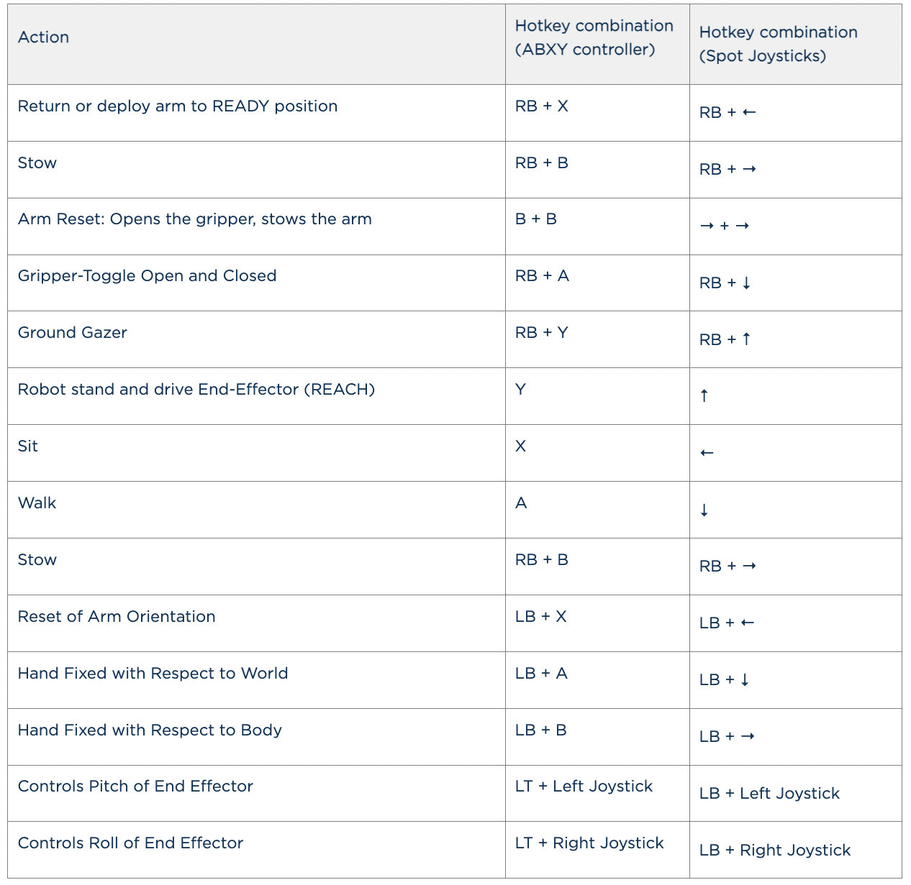{ width="600"; loading=lazy }
</figure>

## Manipulation menu

The manipulation menu can be accessed by opening the applications drop-down and selecting MANIPULATION. From the manipulation menu you can instruct Spot to perform grasping behaviors (1), manipulate an object the robot is currently grasping (2), or drive the robot and arm manually (3).

<figure markdown="span">
    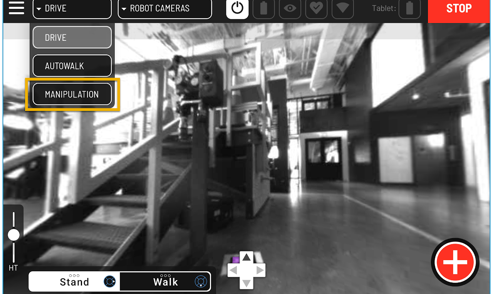{ width="400"; loading=lazy }
</figure>

<figure markdown="span">
    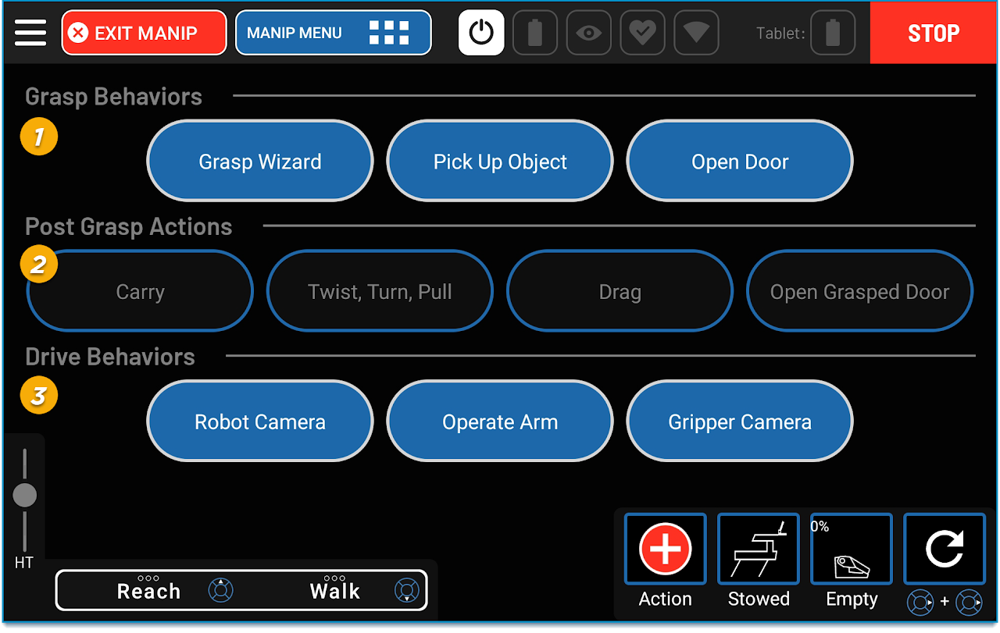{ width="400"; loading=lazy }
</figure>

## Grasp behaviors

- **Grasp Wizard:** Semi-autonomously grasp an object by specifying the approach angle, gripper location, and gripper orientation
- **Pick Up Object:** Select an object for Spot to pick up
- **Open Door:** Approach and semi-autonomously open a door

## Post grasp actions

- **Carry:** Carry an object in the gripper to another location
- **Twist, Turn, Pull:** Manipulate objects that are constrained in how they move, such as cabinets, drawers, levers, switches, ball valves and wheels
- **Drag:** Drag a grasped object of any size. Particularly useful for objects that may be too heavy to carry
- **Open Grasped Door:** If Spot is grasping a door handle, complete the process semi-autonomously

## Drive behaviors

- **Robot Camera:** Switch the tablet view to use the robot's body cameras
- **Operate Arm:** Operate the arm and use the gripper
- **Gripper Camera:** Switch the tablet view to use the gripper cam

## Operate arm

To drive the arm manually: Under **Drive Behaviors**, select **Operate Arm**. 

<figure markdown="span">
    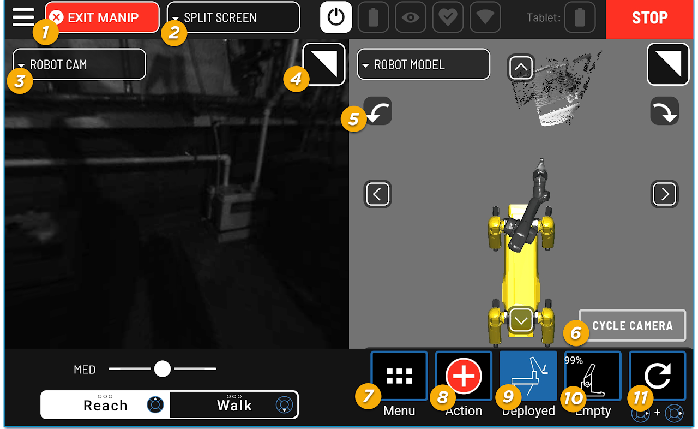{ width="400"; loading=lazy }
</figure>

<figure markdown="span">
    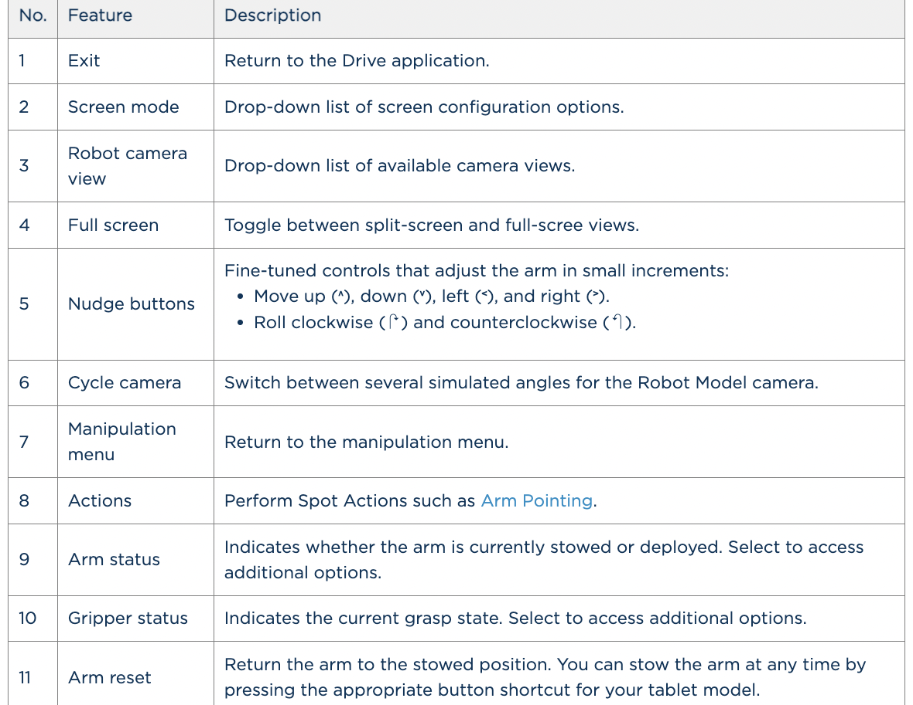{ width="600"; loading=lazy }
</figure>

## Gripper cam view options

Using the gripper cam via the camera dropdown list will provide you with additional controls unique to the gripper view. By either selecting the screen or DEFAULT GAZE you will enter Gaze mode, which allows you to more effectively aim and focus the gripper camera at a target.

<figure markdown="span">
    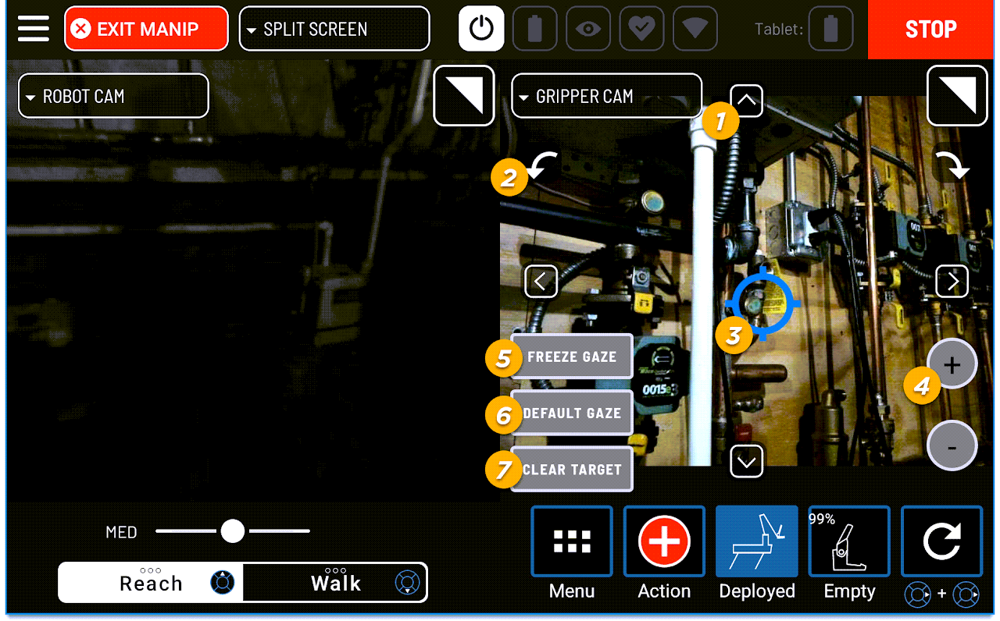{ width="400"; loading=lazy }
</figure>

1. Nudges the gripper in small increments

    - While in Gaze mode, these arrows will adjust the crosshair instead (gaze target)

2. Rotates the gripper itself in small increments

3. Crosshair: Appears while in Gaze mode. When not gazing, the crosshair is hidden

4. Distance control: Moves gripper closer (+) or further (-) from gaze target

5. FREEZE GAZE: Selecting this switches from gaze control to joint level freeze to make gazing steadier

6. DEFAULT GAZE: Selecting this enters Gaze mode. Selecting the screen itself while in gripper cam view also enters Gaze mode

7. CLEAR TARGET: Removes gaze target and clears the crosshair from the screen

## Deploying and stowing the arm

1. Select MANIPULATION in the application menu
2. Select Operate Arm under Drive Behaviors. The robot will stand. The arm will move to the Stowed position
3. Deploy the arm to the Ready position by selecting the arm in the arm status bar
4. An arm status panel will appear with the option to Stow the arm, or deploy it into the carry or ready position. Select Ready and then close the menu

    <figure markdown="span">
        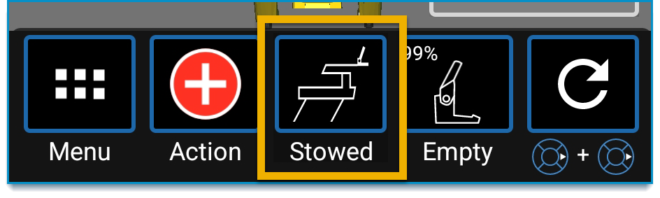{ width="400"; loading=lazy }
    </figure>

    <figure markdown="span">
        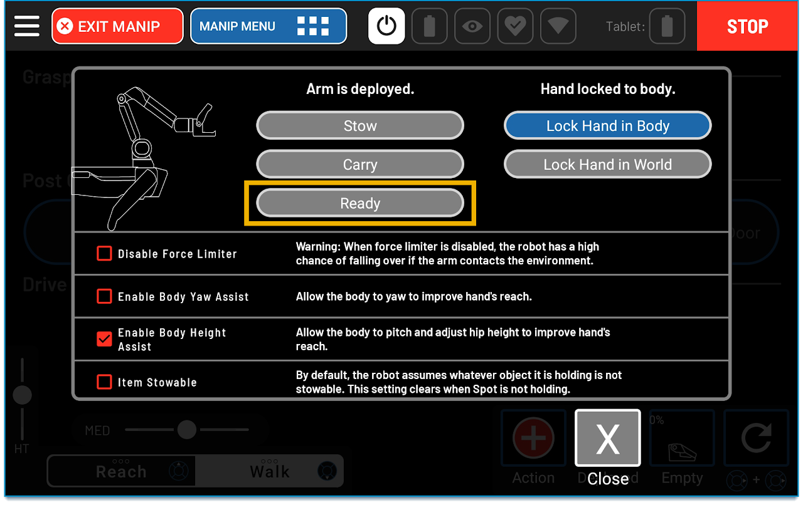{ width="400"; loading=lazy }
    </figure>

5. Confirm that the arm status is now Deployed

    <figure markdown="span">
        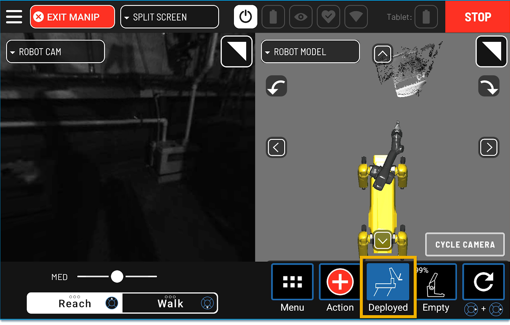{ width="400"; loading=lazy }
    </figure>

6. Return the arm to the Stow position by once again selecting the arm in the arm status bar

7. From the menu, select Stow. The arm moves into the predefined Stow position. Close the menu and note that the status of the arm changes to Stowed

8. From the Stowed position, place the arm back into the Ready position by using the Ready hotkey combination

9. Return the arm to the Stowed position using the Stow hotkey combination

## Controlling the end-effector

In Reach mode, joysticks on the tablet drive the end-effector. The body turns and changes height to extend its range, but the robot does not take any steps. In this example, the Operator uses the joystick controls in Reach mode to first explore the range of arm motion around the robot, and then to draw a rectangle with the end effector. 

<figure markdown="span">
    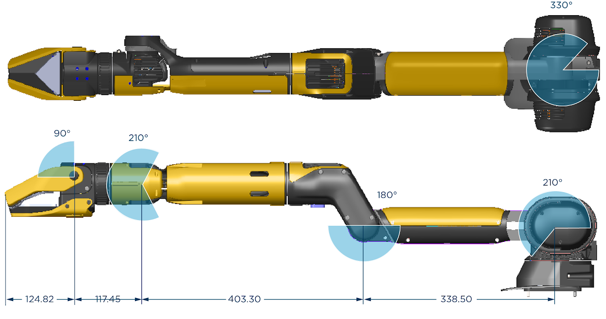{ width="400"; loading=lazy }
</figure>

<figure markdown="span">
    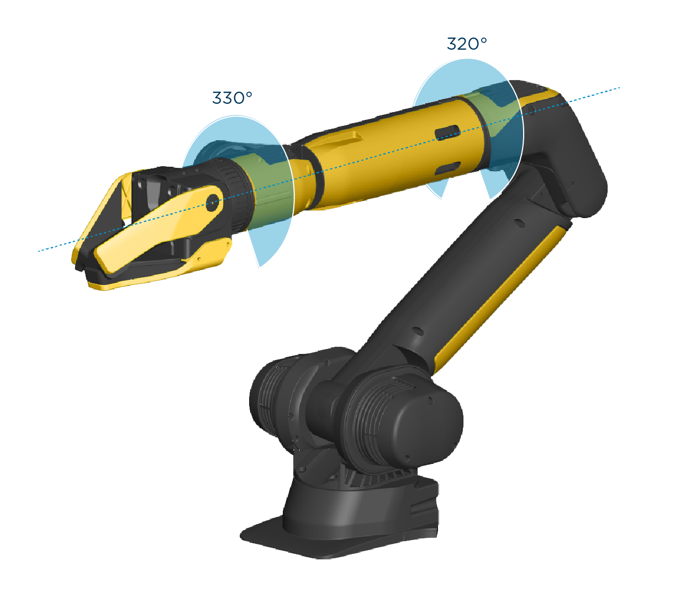{ width="400"; loading=lazy }
</figure>

1. Select Manipulation in the application menu

2. Select Operate Arm under Drive Behaviors. The robot arm will be in the Stow position

    <figure markdown="span">
        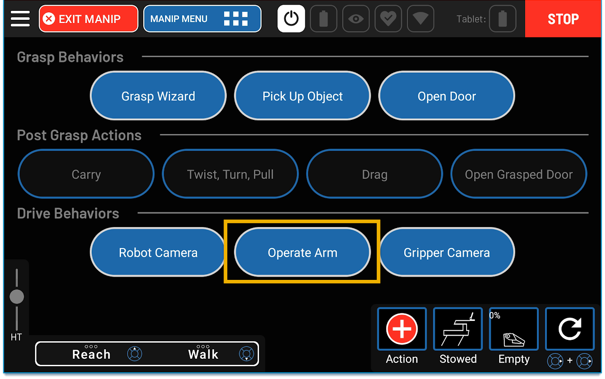{ width="400"; loading=lazy }
    </figure>

3. Deploy the arm into the Ready position using the RB+X hotkey combination. Note that the status of the arm has changed to Deployed

4. Using the right joystick, press in the up direction to move the end effector up until the arm and end effector have stabilized, then in the down direction to lower the end effector until it touches the floor. Note that the body will adjust its height in response

    <figure markdown="span">
        { width="400"; loading=lazy }
    </figure>

5. Return the arm to the Ready position using the hotkey combination on the tablet

6. From the Ready position, use the left joystick to move the arm forward as far as it will extend. Then use the left joystick to move the arm all the way left. Note that the arm will extend almost 180 degrees and that the robot body twists to facilitate the arm movement but will not step

7. Now use the left joystick to move the arm to the right. Note that the arm will traverse almost 360 degrees.

8. Return the arm to the Ready position using the hotkey combination. If the robot's feet are twisted when the Arm is returned to Ready, select Walk and take a step to reorient the legs

9. With the robot in Reach mode, combine left and right joystick movements