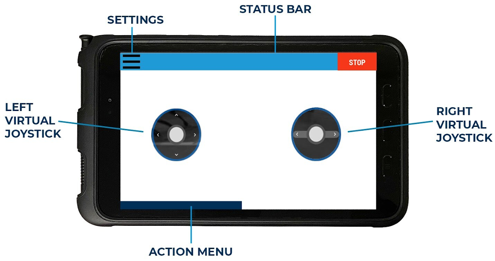
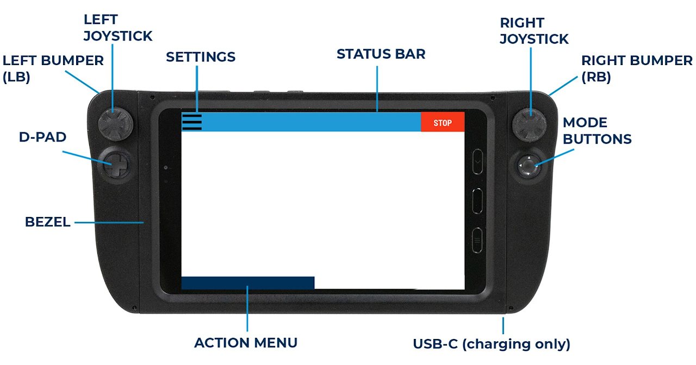
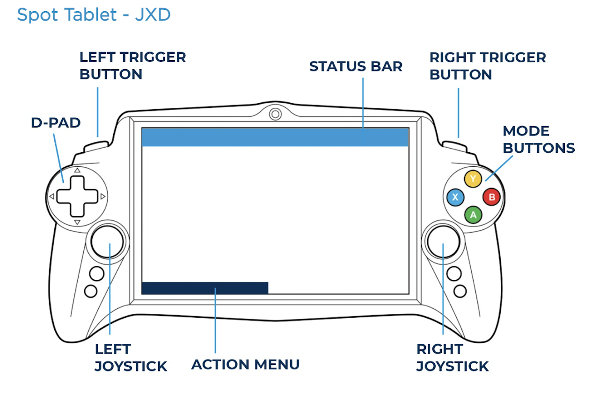
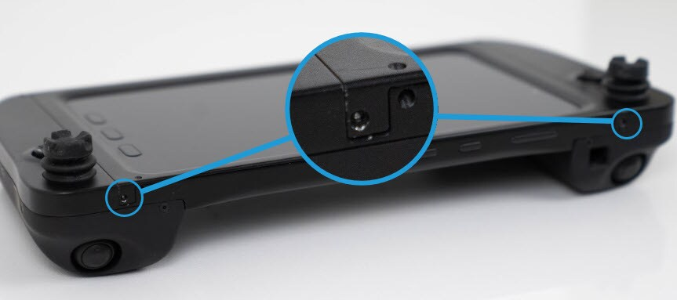

???+ abstract "Objective"
    Learn about the controller layout.

## Spot Tablet

**Spot Tablet - Samsung Galaxy Tab Active3**

<figure markdown="span">
  { width="400"; loading=lazy }
</figure>

**Spot Tablet Joysticks**

The Spot Tablet Joysticks are designed to fit around the Samsung Galaxy Tab Active3 pictured above. Note that any case the tablet is in must be removed prior to fitting into the joysticks.

<figure markdown="span">
  { width="400"; loading=lazy }
</figure>

**Spot Tablet JXD**

<figure markdown="span">
  { width="400"; loading=lazy }
</figure>

## Tablet installation

1. Remove the bezel by pressing into the two pins at the top of the tablet and pull upward on the bezel at the same time.

    ???+ note
        For example, a ball point pen or 1.5mm Allen wrench could be used to push the pins in.

    <figure markdown="span">
      { width="400"; loading=lazy }
    </figure>

2. Place the bottom edge of the Spot Tablet (side with the pogo pins) into the Tablet Joysticks. Rotate the top of the Samsung tablet into the joysticks.
    - Push the bottom of the bezel into the joysticks.
    - Rotate the top of the bezel down.
    - Snap the tops of the bezel down into the two pins.

## Tablet removal

1. Remove the bezel by pressing an object like a ball point pen or 1.5mm Allen wrench into the ball detent and pull upward on the bezel at the same time

2. Use a tool like a 1.5mm Allen wrench on the rear holes to push the tablet slightly out. 

## Charging

- Use the USB-C port labeled above.
- Can be charged at either 10W with a 2A charger or 15W.