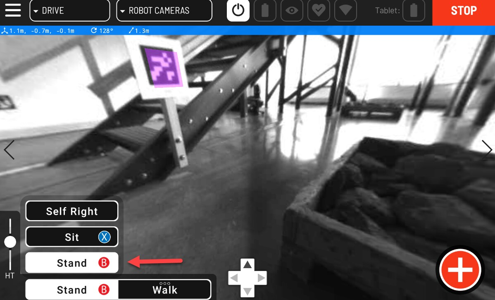
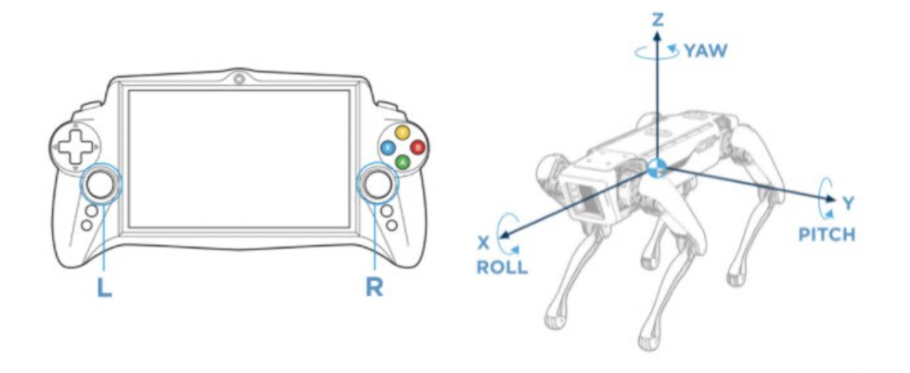
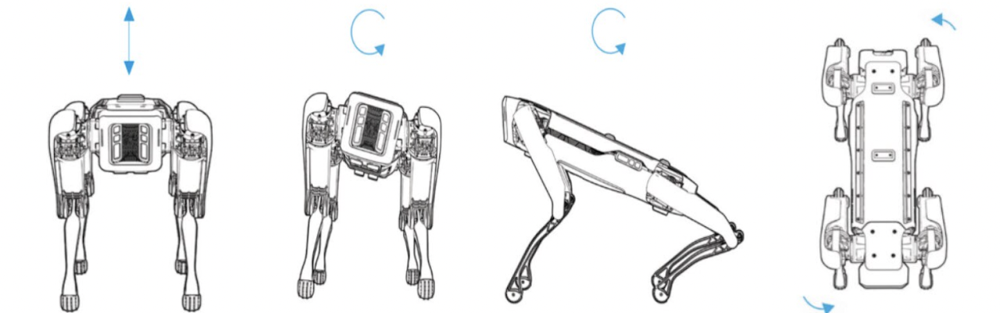
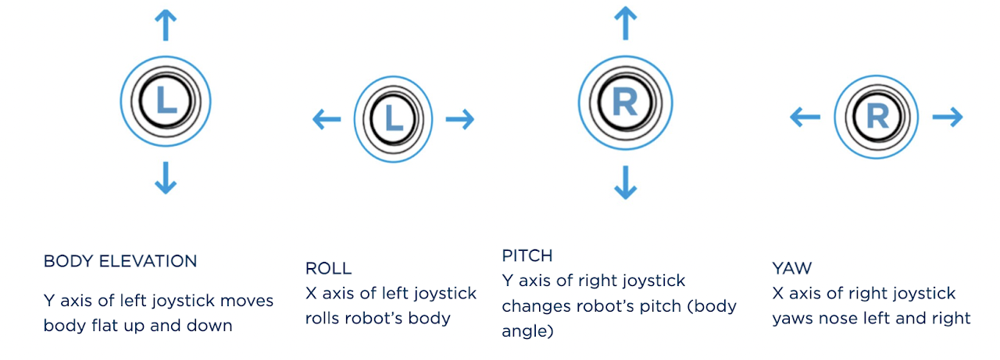

???+ abstract "Objective"
    Learn how to pose Spot using a controller.

<figure markdown="span">
    { width="400"; loading=lazy }
</figure>

## Posing options

Use the controller’s joysticks to pose Spot’s body while it is in Stand mode. Its feet should remain still. However, Spot may adjust its feet to maintain balance if necessary.

<figure markdown="span">
    { width="400"; loading=lazy }
</figure>

<figure markdown="span">
    { width="400"; loading=lazy }
</figure>

<figure markdown="span">
    { width="400"; loading=lazy }
</figure>

## Practice posing Spot

- From the sit position, stand Spot by pressing and holding Stand on the controller or just press the B button
- From the standing position, pose the robot by manipulating the joystick controls
- Adjust the height of the robot using the slider on the tablet screen. Note that the posing functionality is maintained regardless of the robot height. Medium height is the most stable for posing
