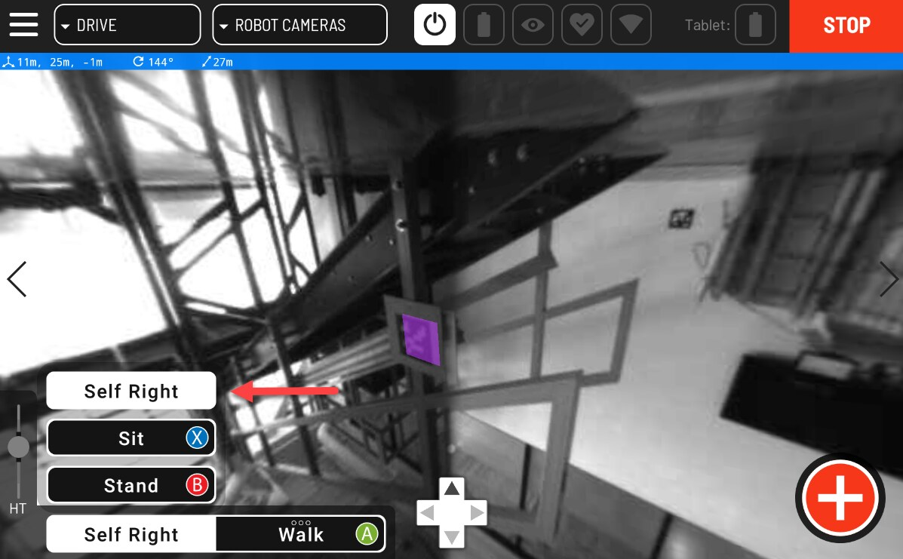

???+ abstract "Objective"
    Learn how to self-right Spot using a controller.

In normal operation, such as changing the battery, Spot can sometimes end up on its back or on the ground with its legs in an unusual position. During the self-righting maneuver, the robot flips using its legs to turn itself over. Its legs are positioned to be ready to stand.

<figure markdown="span">
    { width="400"; loading=lazy }
</figure>

**Now that your robot is powered on and on its back, perform a self-right using the following procedure. If Spot is not on its back, roll it over to get a feel for how self-righting works:**

- Make sure the robot has 2m of clearance all around it
- Using the controller’s action menu, press and hold Stand or press the B button and then tap Self Right
- The robot will attempt to roll over by moving its legs
- The robot will stop moving and then sit

**If Spot fails to self-right:**

- Turn off the robot's motors via the controller app
- Press the motor lockout button on the robot
- The robot's limbs will go slack. If Spot is upright or standing, it will fall
- Manually move legs and body into “sit” position
- Take extra care to avoid hip and knee pinch points
- Release lockout button
- Use the controller to turn on motor power, then attempt the self-right maneuver again