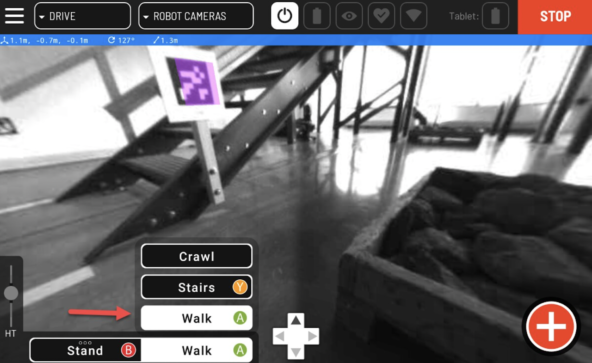

???+ abstract "Objective"
    Learn how to make Spot walk using a controller.

Spot can walk in most places that a person can. Only walk Spot in a safe operating environment as outlined in this guide.

## Options for operation

There are two ways to operate Spot:

- Using the joysticks on the Spot tablet controller

- Using touch-to-go on the controller screen

<figure markdown="span">
    { width="400"; loading=lazy }
</figure>

## Walking Spot using the controller joysticks

- On the controller app, select Walk from the action menu or press the A button. If Spot is sitting, it will stand up

- Use the right joystick to turn Spot. This is easiest when standing a safe distance behind Spot

- Use the left joystick to move Spot’s body. It can move forward, backward, right, and left

- To stop movement, release the joysticks

## Practice walking Spot

- Put Spot into walking mode by selecting Walk from the tablet menu or pressing the A button

- Walk Spot in a circle or figure 8 going forward

- Walk Spot in a circle or figure 8 going backward

- Turn Spot 360 degrees using the right joystick

