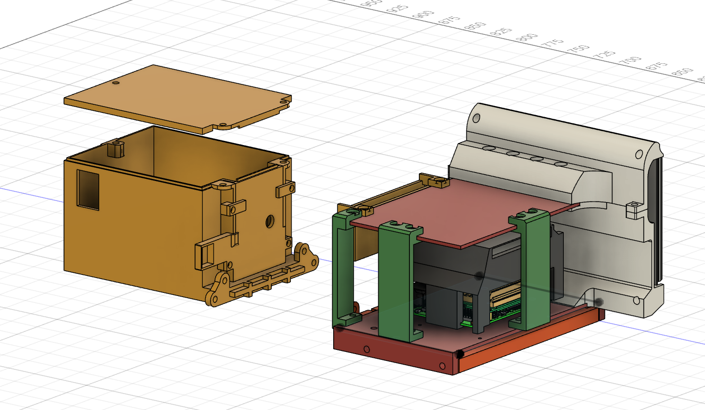

--- 
title: OpenPayload
---

<figure markdown="span">
    { width="800"; loading=lazy }
</figure>

???+ note
    OpenPayload is as an open source framework. Use/replication will require modification by the end user.

## Goal

The goal of this project was to make an affordable and easily customizable payload. Most components are 3D printable, and the payload can be easily attached to Spot.