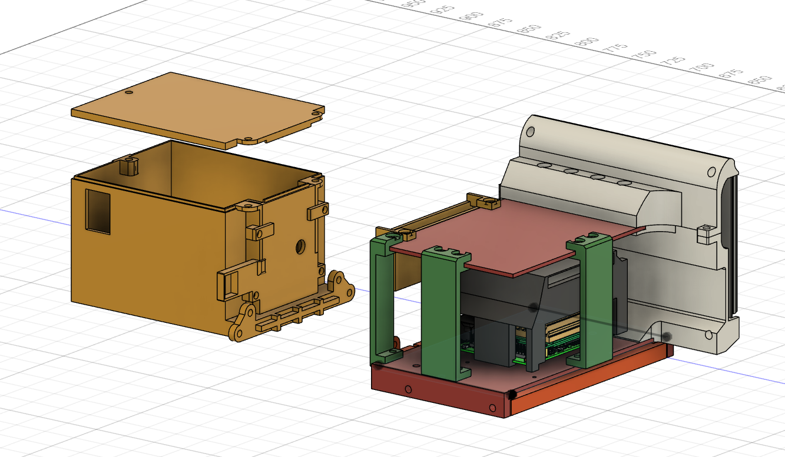

--- 
title: OpenPayload
---

<figure markdown="span">
    { width="800"; loading=lazy }
</figure>

???+ note
    OpenPayload is as an open source framework. Use/replication will require modification by the end user.

## Overview

The payload is designed with modularity in mind, featuring a base plate that attaches to Spot and an upper payload that can be easily removed and customized. Most components are 3D printable, making it cost-effective and adaptable.

## Key Features

- Easily changeable upper payload
- 3D printed components for cost-effectiveness
- Separate power and networking systems
- Removable platform design

## Components

### 3D Printed Parts (PETG Filament)

- Electrical Box Cover
- Electrical Box
- Electrical Box Front Plate
- Base Plate
- 3 Payload Supports
- Payload Plates
- USB Expansion Hub Holder
- Top Screen Holder
- Bottom Screen Holder

???+ note
    A fan holder design exists but was not manufactured in this version.

### Electrical Components

- DB25 pinout board
- Switch
- Two step-down converters
- Female ethernet port holder
- Jetson Nano (mini-computer)
- 7-inch Waveshare screen
- 5V fan
- Microphone
- Speaker

### Miscellaneous Hardware

- M5 screws and nuts
- M2 nuts and standoffs
- Ethernet cable (male and female ends)
- Pigtail male barrel jack wire
- Assorted wiring

## Assembly Instructions

1. Print all 3D components using the following settings:

    - 15% Gyroid or Crosshatch Infill
    - Tree Supports (small overhangs not ignored)
    - PLA or PETG filament recommended

2. Assemble the base plate and attach it to Spot.
3. Install electrical components in the electrical box:

    - DB25 pinout board
    - Switch
    - Step-down converters
    - Ethernet port holder

4. Mount the Jetson Nano, USB expansion port, screen, fan, microphone, and speaker on the payload plates.
5. Connect the upper payload to the base plate using four screws on the side.
6. Wire all components (refer to the Boston Dynamics documentation for detailed [electrical interface information](https://dev.bostondynamics.com/docs/payload/payload_configuration_requirements.html))

???+ note
    The Jetson Nano requires a jumper on J48 for the barrel jack power to function correctly.

## Resources

- Full list of materials: [materials list](https://docs.google.com/spreadsheets/d/1aPwQUTKW9bW56pQ-5zNia58Ss7w5eJyR2B_aeXNMcI8/edit?gid=0#gid=0).
- STL files for 3D printing: [STL files](https://www.printables.com/model/968280-openpayload).
- For detailed electrical interface information, refer to the [Boston Dynamics Payload documentation](https://dev.bostondynamics.com/docs/payload/robot_electrical_interface).