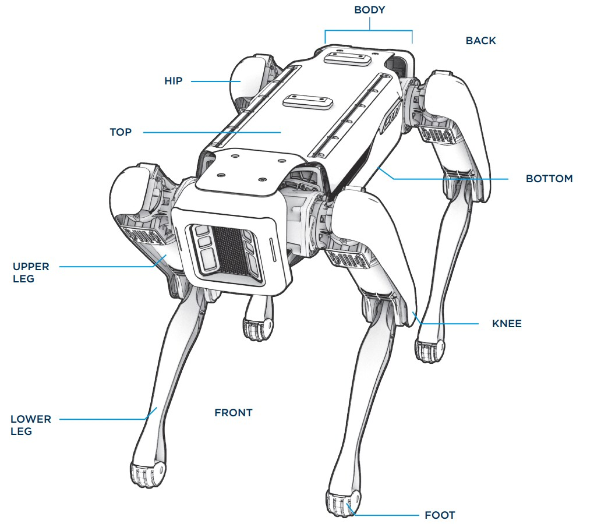
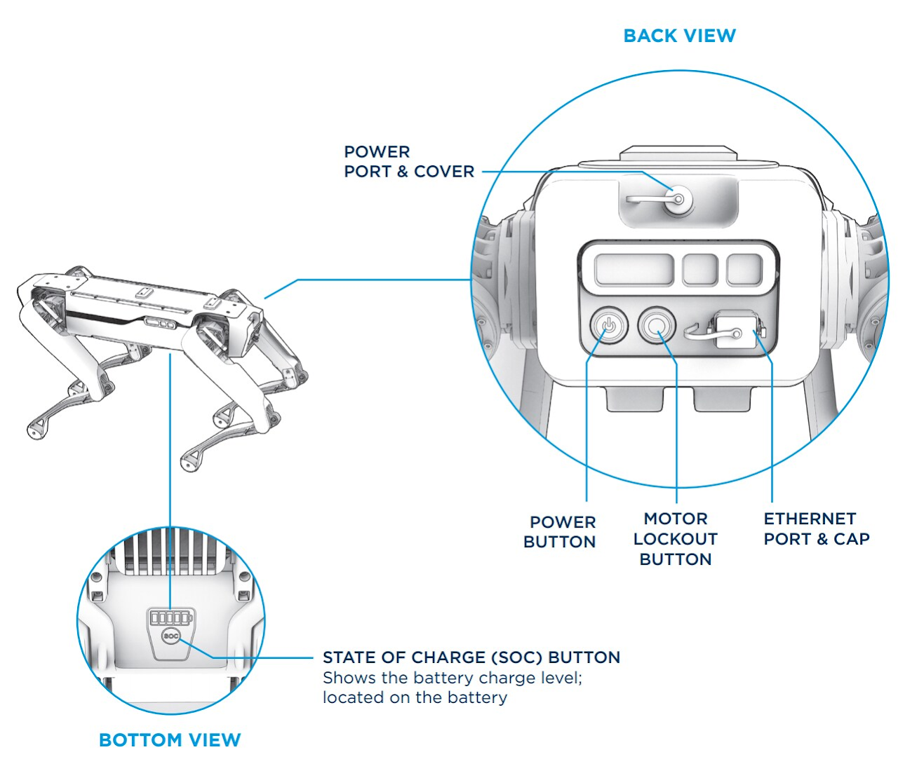

???+ abstract "Objective"
    Get to know the parts and features of Spot, along with its basic operation philosophy and limitations. 

## Spot components

- five stereo cameras (two at the front, one at each side, one at the rear)

- a pair of status light LED strips at the front of the robot

- two payload mounting rails along the top sides of the body, and two payload ports at the top rear and top middle of the body. Spot is capable of handling Boston Dynamics payloads, or custom homegrown payloads. 

- lifting handles on each of Spot's hips. 

- 2 actuators in each hip, and one actuator in each knee. The hip joints are referred to as HX and HY for each plane of rotation. This creates the following degrees of freedom and limits on each axis: 12 DOFs, 3 per leg. 

<figure markdown="span">
  { width="400"; loading=lazy }
</figure>

## Buttons and ports

Spot's power port and cover are at the back of the robot near the top. Below on the back of the robot are the power button, the motor lockout button, and the ethernet port and cap. Each Spot Battery has a State of Charge (SoC) button which displays the battery charge level as a row of up to five LEDs. 

<figure markdown="span">
  { width="400"; loading=lazy }
</figure>