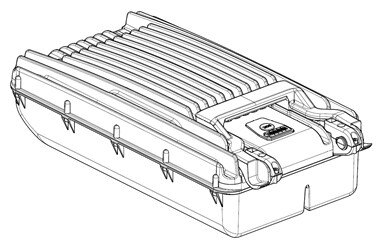
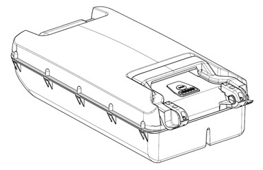
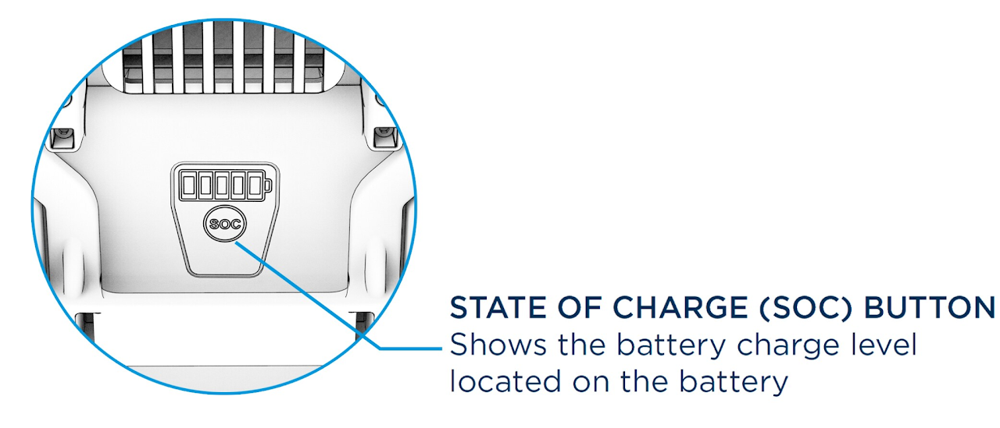
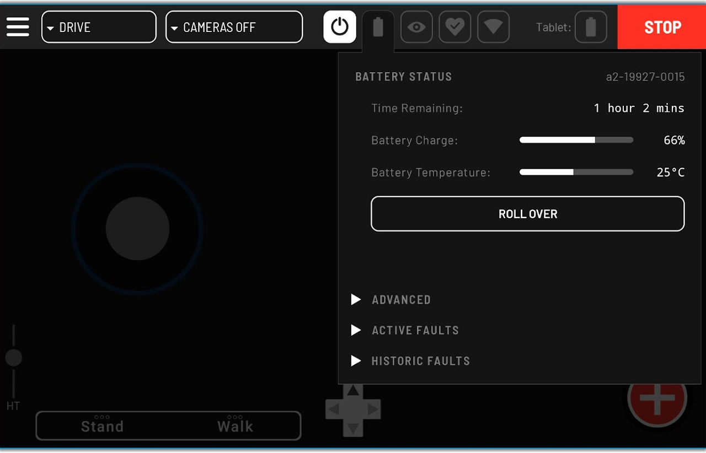

???+ warning
    **To reduce risk of electric shock and fire, or damage to Spot or related components:**
    - Only use Boston Dynamics-approved Spot Batteries and Spot Chargers to charge or power the robot or batteries.

    - Connect the charger to a properly grounded AC outlet. Do not use ground adapters or replace the plug.

    - Do not use the power cables if they are damaged.

    - Do not touch uninsulated parts of the charger's output connector or battery terminals.

    - Do not open or disassemble the charger or battery.

    - Do not short-circuit, burn, disassemble, submerge, puncture, crush, drop, or damage the battery. Contact support@bostondynamics.com with any concerns regarding damaged batteries.

    - If a battery fire starts, do not attempt to put it out. Evacuate to a safe area and call the fire department. Battery fires create toxic fumes and cannot be put out with conventional fire extinguishers or water.

    - Spot operators should develop a battery storage and charging safety policy consistent with industry standards and local regulations.

    - Always remove the battery from robot during transportation or storage.

## Spot charger components

**Charging case:** Central to all charging configurations.

**Power cable:** Connects charging case to wall power (AC) for all charging configurations.

**Shore power cable:** Connects charger to Spot's shore power port for charging a battery in Spot or operating computers via shore power.

**Battery charging tray:** Place battery into tray to while the charger is plugged in and powered on to begin charging.

## Spot charger specifications

**Operating temperature:** 0°C to 45°C

**Input specifications:** 100-240 VAC, frequency 50/60Hz, current 8A Max

**Charge time:** Approximately 1 hour (temperature and battery dependent) output: 35-58.6 VDC, 12 A max

## Spot Enterprise and Explorer batteries

**Spot Enterprise and Explorer batteries are the same except for two main differences:**

- The Enterprise Battery is 1kg heavier than the Explorer Battery.

- The Enterprise Battery has a row of fins to help cool the battery during charging, whereas the Explorer Battery has a smooth, yellow cap.

<figure markdown="span">
  { width="200"; loading=lazy }
  <figcaption>Enterprise battery</figcaption>
  { width="200"; loading=lazy }
  <figcaption>Explorer battery</figcaption>
</figure>

## Determining the battery charge level

The SoC (State of Charge) button on the battery illuminates LEDs to show the battery level when pressed.

<figure markdown="span">
  { width="400"; loading=lazy }
</figure>

The robot controller also shows the battery level. Tap the battery icon in the info bar at the top of the tablet screen. When the robot runs out of sufficient battery power, the motors will power off and Spot will sit.

???+ note
    The **ROLL OVER** option will only be available if the robot's motors are actively powered on.

<figure markdown="span">
  { width="400"; loading=lazy }
</figure>

## Charging the battery

**Spot charger battery tray**

With the Spot Charger plugged in and powered on, align the connector between the battery and the charging tray and place the battery into the tray to begin charging.

It is easier to keep the battery cool when using the direct method to recharge. While the battery can discharge at much higher temperatures, it will only charge when under 45°C.

**Shore power**

Use the shore power cable to connect the charger to the robot and charge a battery while installed in a Spot robot. With the charger plugged in and powered on, insert the charging cable into the charging port at the back of Spot while being careful to orient the plug correctly using the white dot on the connector and socket.

- For Explorer models, the white dot on the connector should be facing the belly of the robot. 

- For Enterprise models, the white dot on the connector should be facing the top of the robot.

Do not attempt to force the connector. Misaligning the connector can damage it.

The Spot Charger will always default to charging a battery in the charging tray over the battery in the robot using shore power. If a battery is placed in the charging tray during shore power charging, the Spot Charger will default to charging the battery in the tray after 1 minute.

The battery will begin charging regardless of whether Spot’s computers are powered on or off.

## Hot swapping the battery

When on shore power you can safely hot swap a battery (change batteries without powering down the robot). To perform a hot swap:

1. Flip Spot onto its back with motor lock-out engaged.

2. Connect the shore power cable to the robot.

3. Replace the battery inside the robot with a fully charged battery.

4. Remove the shore power cable.

This is a method to use Spot for periods that extend beyond the capacity of a single battery charge. 