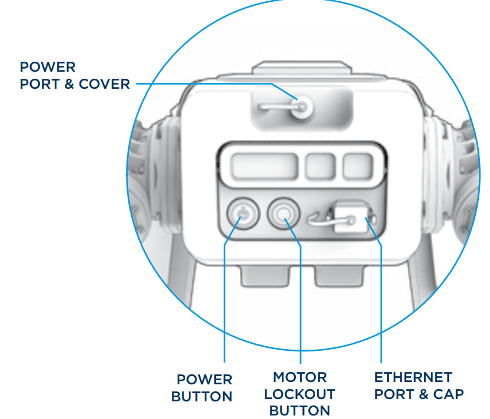
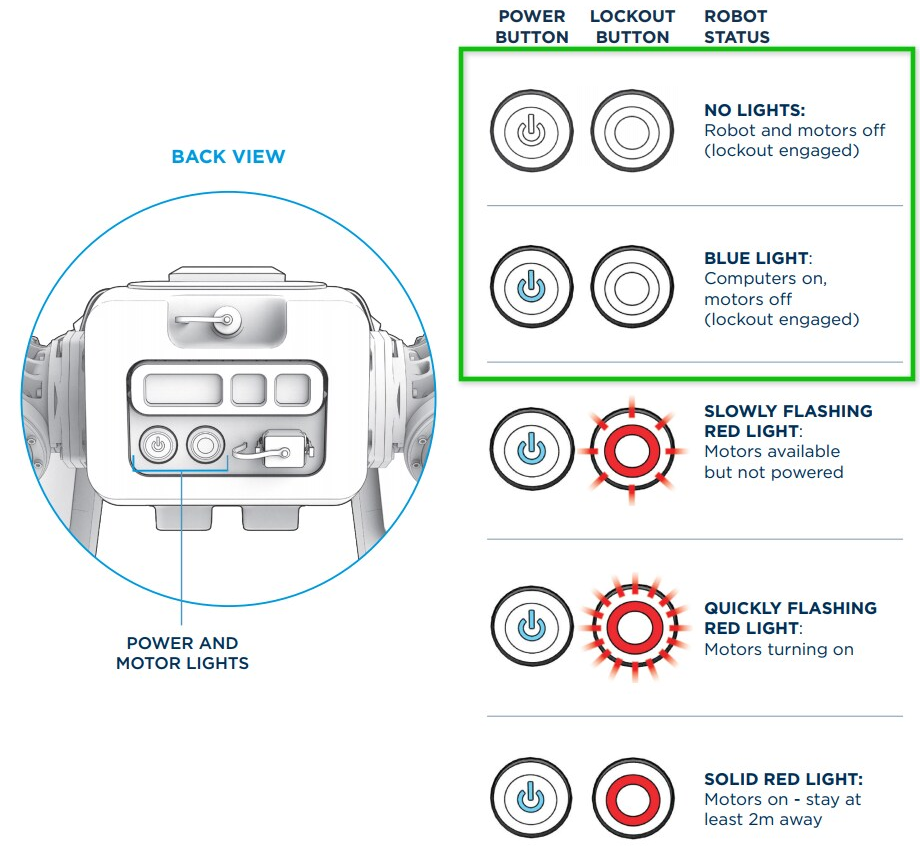

???+ abstract "Procedure"
    Follow these step-by-step instructions to power on your robot. For any issues that arise with powering on, inspection, or otherwise, contact support@bostondynamics.com.

## 1. Perform a pre-startup inspection

**Before starting Spot up, perform a visual inspection of the robot. In best practice, this should include:**

- Inspection of Spot crash protection, ensuring it is secured and without cracks or other damage. 

- Inspection of camera modules.

- Inspection of the battery and the battery compartment, ensuring it is free of cracks, debris or other foreign objects. Now is a good time to record the user account password located in the battery compartment.

## 2. Power Spot on

**Before powering on the robot, make sure that:**

- The Spot battery is sufficiently charged

- Spot is unplugged from power and Ethernet

- The power plug cover and Ethernet cover are properly inserted and not hanging loose

- Bystanders and observers are at least 2m away from the robot 

<figure markdown="span">
  { width="400"; loading=lazy }
</figure>

**To power Spot on:**

1. Roll the robot onto its back and insert the battery.

2. Ensure the battery is properly seated and secure in the battery compartment.

3. Press and hold the Power button for two seconds. You will hear the fans turn on and spin loudly for approximately two minutes. During this time, Spot's computers are booting and its hosted WiFi network is initiating. 

4. When the lights on the front of the robot are flashing rainbow and the noise of the fans is audibly lower, follow the steps below to connect the controller. 

???+ warning
    Spot may not appear to power on at all depending on the state of the battery. If the charge level is only at one or two bars (less than 40% charged) or is too warm from charging or heavy use, the robot may not turn on. Always power on the robot using a sufficiently charged, cool battery.

## 3. Connect the controller

???+ note
    Spot has built-in WiFi. It can host its own WiFi network as an Access Point, or join an existing network. Default usernames and passwords for Spot’s WiFi are stored in the battery compartment. Payloads can expand Spot’s connection options.

    For the purposes of this getting started tutorial, the instructions below will guide you through connecting the controller via Spot's built-in WiFi network. 

**To connect the controller to the robot:**

1. Confirm that the robot is powered on. 

2. Power on the controller.

3. Open the Spot App which is pre-loaded onto the controller. 

4. Select the appropriate network as directed by your system administrator. For most initial configurations, this is Spot’s built-in access point.

5. Select your robot from the list of available WiFi networks or add your robot to the network using “Add Robot.”

6. Enter a valid user name and password. When first starting up the robot, use the default user credentials you recorded as part of the pre-startup inspection process in this instruction.

7. Select “Observe” or “Power On” on the controller then follow the next steps to enable Motor Power.

## 4. Enable motor power

**When you are ready to operate the robot, the motor lockout must be disengaged to enable motor power. As a reminder, absolute safest handling status indicators are highlighted in green below.**

1. Notify any bystanders that motors will be active. Spot could now move unexpectedly and people should maintain a 2 meter (minimum) safety distance from the robot. 

2. Unlock the motors by pressing the motor lockout button. The button will slowly flash red. This indicates that the motors are unlocked and can be powered on via the tablet. 

3. Turn motor power on via the tablet by clicking on the power icon, then slide the motor toggle to on. 

4. The button will flash faster until motors are powered, at which point the button will display as solid red. 

<figure markdown="span">
  { width="400"; loading=lazy }
</figure>