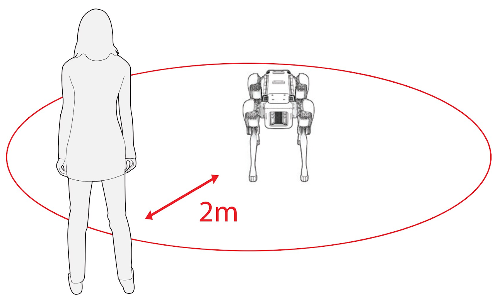
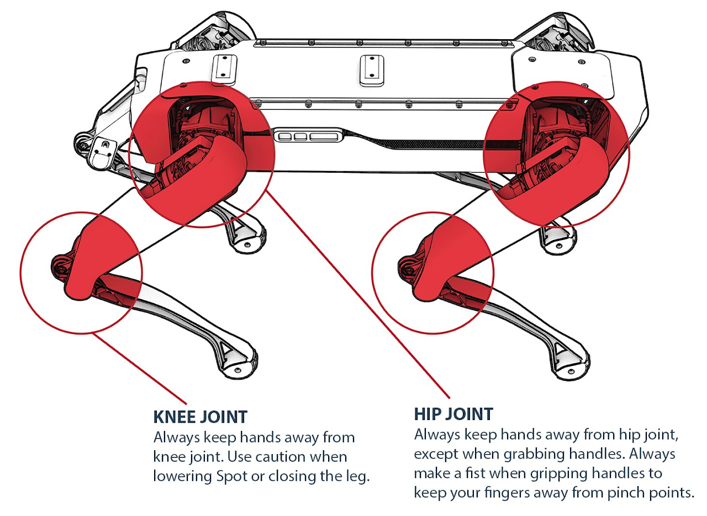
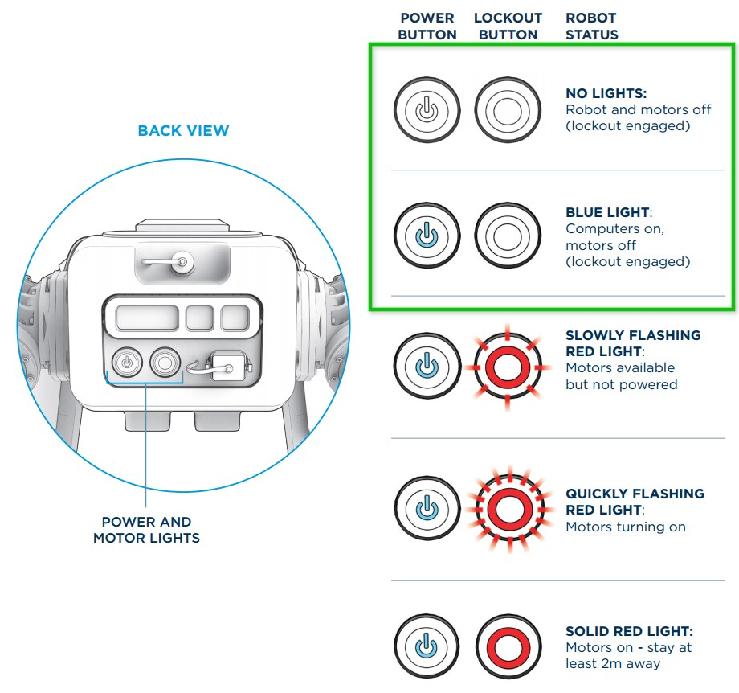
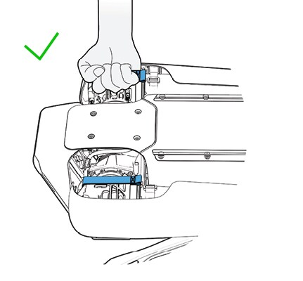

**Space and storage requirements**

Once Spot arrives on site, there are a few spatial considerations you will want to be prepared for.

## Storage and safety

Your entire Spot system will arrive in three separate shipments: 

- **The Spot case** containing Spot and the controller tablet (Case Specs: 25" x 21" x 39"; 125 lbs with the robot and tablet). You'll want to think about where you will store Spot and all of the system components. Spot is best stored in the case or at a Spot Dock when not in use, so you will want a safe and secure area designated for this purpose.

    - If you ordered the Enterprise version of Spot, the **Spot Dock** will arrive in its own case along with the robot. About the Spot Dock Self-Charging Station will be useful knowledge to refer back to as you progress towards Spot operation. 

- **Battery and charging system** containing the charger, all applicable charging cords and two Lithium Ion Spot batteries. We recommend that you develop a battery safety and storage policy that is aligned with your local and state regulations regarding batteries of this type.

    - Because Spot batteries are Lithium Ion (access the Spot Battery Safety Data Sheet (SDS) here) we recommend developing battery safety, charging and storage policies that align with the local and state regulations regarding batteries of this type. If your business has a Safety Officer, this may be a good place to start. 

- **Calibration panel** used for calibration of the Spot cameras. This panel should be stored in the same location as the robot to facilitate the re-calibration process in the field. 

???+ note
    You may want to consider assigning a designated area for battery charging and overnight storage. Here, you could clearly post your policies around battery charging, safety and storage for the benefit of your team and those working within your facility.

## Space requirements for Spot operation

When Spot's power is on, you want to ensure you have sufficient space to operate the robot while maintaining our recommended safety distance of at least 2 meters (6 ft) between the operator or any bystanders, and the robot.  

<figure markdown="span">
  { width="400"; loading=lazy }
</figure>

If you are first operating Spot indoors such as in a school classroom, it is always best to push tables and chairs out of the way and secure any loose cords or wires that could hinder the robot's movement.

Once you build confidence with the basic operation of the robot, you may want to test its performance on stairs and more difficult terrain. Before you operate Spot, think about spaces at your site that may be engaging, such as a staircase or outdoor area where you could eventually take the robot for a walk and test out its mobility.  

## Pinch points

Spot’s joints can pinch fingers and other body parts and entangle loose clothing, long hair, and jewelry.

<figure markdown="span">
  { width="400"; loading=lazy }
</figure>

???+ warning
    Added payloads to Spot means an increase in the amount of possible pinch points on the robot. Always exercise caution and identify potential new pinch points on the robot when mounting payloads. 

## Safe handling conditions

**Spot should only be handled when the power is OFF, or if the robot power is ON with motor lockout engaged.** You can verify the power status of the robot by referencing the power and motor lockout buttons at the rear of the robot. The power conditions outlined in green are considered safe for handling. More information to follow in this series.

<figure markdown="span">
  { width="400"; loading=lazy }
</figure>

## Spot handles

Spot has a handle at each hip joint. Use these to lift, carry, and roll the robot. When using the handles, always make a fist with each hand. Whenever possible, use the handles to manipulate Spot. 

<figure markdown="span">
  { width="400"; loading=lazy }
</figure>

???+ warning
    With payloads (especially Spot Arm) mounted onto the robot, extra caution must be exercised, even when properly grasping the handles.

???+ note
    Refer to [Unboxing Spot](unboxing-spot.md) for information on safely lifting and rolling Spot.