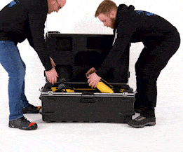
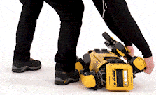
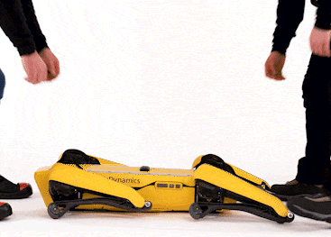

# Unboxing Spot

???+ abstract "Objective"
    Safely unpack Spot.

???+ warning
    The initial unboxing and handling of Spot should be carried out by adults. Over time, students can be trained and certified to take on these tasks, but under the constant supervision of adults.

## Safely unboxing and lifting Spot

Spot is heavy (32.7 kg or 72.1 lbs with a battery) and can be awkward to carry, particularly with attached payloads. Always grab the handles or legs with clenched fists and maintain safe lifting precautions.

Before removing Spot or any of its elements, from the case, make sure you have prepared an unencumbered space sufficient to handle its contests. It is recommended that a soft tiled area is used to place Spot.

Always use two people to lift Spot, one at the front and one at the rear, as pictured below. Your case configuration may differ slightly as depicted below. 

<figure markdown="span">
  { width="400"; loading=lazy }
</figure>

## Safe rolling

Rolling Spot from its belly to its back (or vice versa) can be done with only one person. The handles should always be used to avoid pinch points.

<figure markdown="span">
  { width="400"; loading=lazy }
</figure>

When lifting with the handles, always grab the handles with clenched fists and maintain safe lifting precautions.

<figure markdown="span">
  { width="400"; loading=lazy }
</figure>